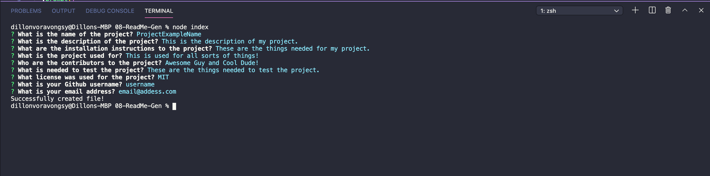
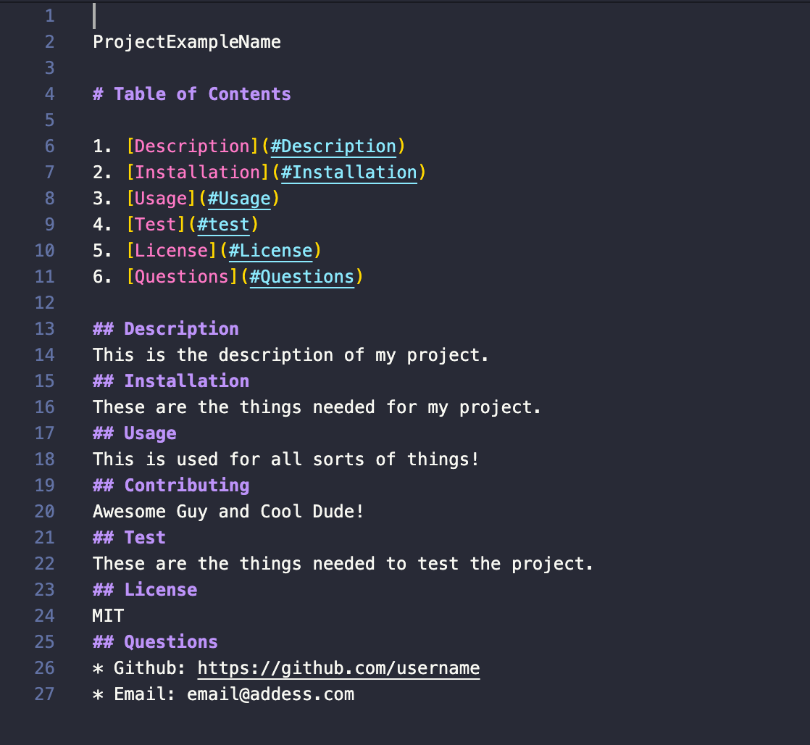

README-Generator

# Table of Contents

1. [Description](#Description)
2. [Installation](#Installation)
3. [Usage](#Usage)
4. [Test](#test)
5. [License](#License)
6. [Questions](#Questions)

## Description
This script will generate readme files for your project. The use for this is to make it more easier and less time consuming when creating a readme file from the ground up. 
This is the code that is displayed when the program is initiated 

This is showing a readme.md that is generated.

      
## Installation
You would need to have Node.js to run the program. Also the required npm packages of inquirer.
## Usage
When using this program, have it installed onto your local machine. In the terminal, run "npm i", and also "npm i inquirer". Then once those have been installed successfully, in your terminal, run "node index". This will start the program and you will be prompt questions for your readme.
## Contributing
No contributors
## Test
Node.js, FS, and inquirer
## License
MIT
## Questions
* Github: https://github.com/dvorav
* Email: d.vorav612@gmail.com

## Demo Video 

